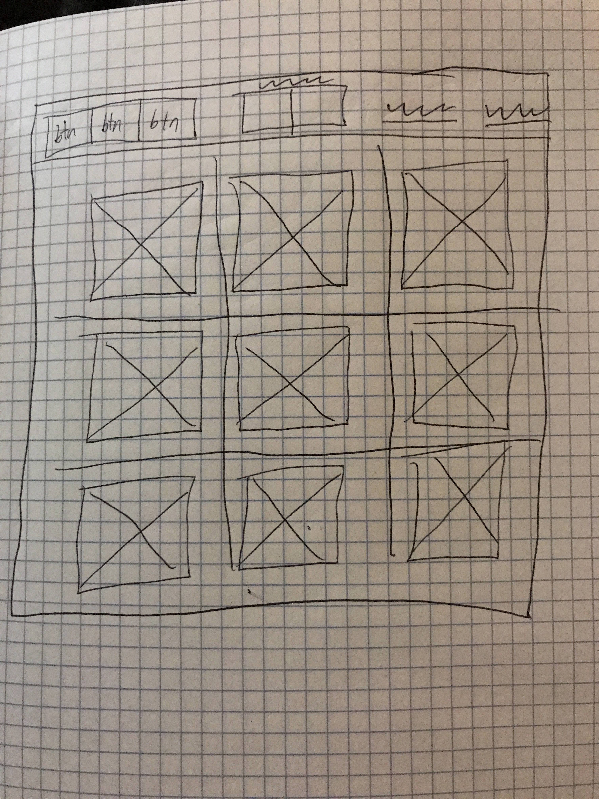

#Tic Tac Toe
##By Sam Dyer
##In Association With General Assembly

Link to hosted application:
[Tic-Tac-Toe Game By Sam Dyer](slammyde7113.github.io/tic-tac-toe/?)

Technologies used:

-   [Webpack](https://webpack.github.io)
-   [Bootstrap](http://getbootstrap.com)
-   [Handlebars.js](http://handlebarsjs.com)
-   [Grunt](https://gruntjs.com/)

Project History:

  The first step of this project started with a planning phase. Planning was incorporate with the utilization of a wire-frame scketch. The wire-frame used in project is linked below:

  

  The project was broken up into the following steps:
- API Set up
- Game Logic Implementation
- Webpage Styling

  API set-up was by far the most difficult part of the project, as it was still a new concept for me to wrap my mind around. Writing curl scripts alleviated the difficulty, however, navigating the potential outputs for the API calls was almost like looking into a black box. At first, I was bashing in commands without any idea of what to expect. After a day or so of playing around with the API inputs and outputs I started to understand why certain result would occur. Once I got a firm grasp of what was happening on the backend of my project, I was able to start working on the game logic.

  Setting up the game logic of the tic-tac-toe board was the most enjoyable part of this process. Solving logic problems and finding multiple solutions to complex problems kept my brain firing on all cylinders. It was a nice break from working on the API because all the logic code was right in front me, which gave me huge advantage when debugging. Once the game logic was fully functional, CSS became my next hurdle.

  I'd like to start off by saying I am not an artistic man, and I think my webpage set up is a clear representation of that fact. I kept my design simplistic, as functionality was my main goal for this project. I added features that made the application more user-friendly, but in the end, I focused on an understandable game with little distractions.

Unsolved Problems

  One issue I have is with the application design. If I had more time I would have implemented some Bootstrap modals to make the webpage more user friendly. I'd also like to edit my code to make it easer to read and less clunky. My next step in editing this application will be packaging my code in functions to create a code that is more DRY.

User Stories:

- When I enter an email and password I should see a prompt that tells me whether or not it was successful.
- When I enter my username/password I should see a prompt telling me whether or not it was successful. Once logged in, I should see a button to check the games I've played, a change password field and button, a sign out button, and a button to create a new game.
  - The change password field lets me change my password and the prompt tells me when its successful.
  - When I pressed the check button I see a list of my game history.
  - When I press the sign out button I see a prompt telling me it was successful and it brings me back to the sign in page.
- When the create button is pressed I see a prompt that shows me the created game id. I also see a join game field with the created game in the input field. There is a join game button below.
  - When I input a previous game, the old game loads or the prompt will tell me that the previous game has already ended. If no game data is available, then the prompt tells me there is no game history.
- When I click the join game button, the game board appears and the create/join game button disappear. The board tiles change to white as I hover the mouse over them.
- When I click a square it, the contents of the square prints an "X" or an "O" depending on whose turn it is. The prompt tells me whose turn it is.
  - When there are three X's in a row, the board disappears and the prompt says that X has won. A button appears that returns me to the game menu.
  - When there are three O's in a row, the board disappears and the prompt says that O has won. A button appears that returns me to the game menu.
  - When the board is filled with no winner, the board disappears and the prompt says that there is a tie. A button appears that returns me to the game menu.
- When I click the return to main menu button, the change password field and button appear, the sign out button appear, the check games button appear, and the create game button appear.
